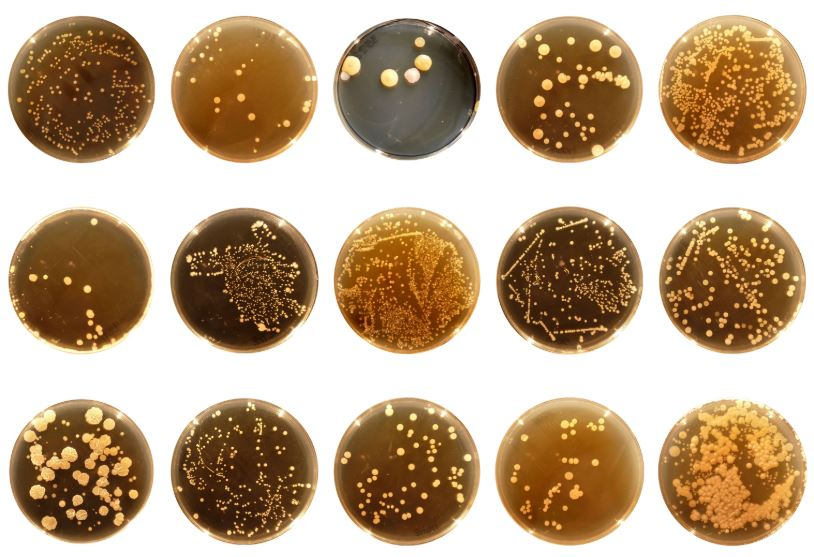

# Life on Us - the Invisible World of Microbes.

## Background

Human eyes can see what they can only see. The smallest visible object to them is just around 0.1 mm (or ~ 1/254 inch). Truth is they can't see the microbes (1/1000 mm or 1/25,400 inch). Thanks to the modern hi-tech microscope with high resolution and manifying capability, now we can see the worlds that we couldn't see before - the worlds of different microbes that live on our body. To them, our body is their earth as the earth to human race.  

In recent research project from the Dept. of Applied Ecology of the North Carolina University, the scientists collected human belly button samples and develop a database that catalogs the microbes colonizing human navels. The dataset reveals a small handful of microbial species knowns as "**Operational Taxonomic Units**", or "**OTUs**".

This Data Anylitics and Visualization project utilizing 3 different chart types: horizontal bar, bubble, and gauge charts of the **Plotly.js** library to shed lights on several questions:  

<ol>
    <li>Demographic Info of each sample donor.</li>
    <li>What are the top 10 microbial species (OTUs) found in each sample?</li>
    <li>What are the names of bacteria found in each OTU?</li>
    <li>How many times a week does each sample donor wash their belly button?</li>
</ol>
 

    
    
<b>Amazing diversity of cultured bacteria</b> (<em>Courtesy of North Carolina State University - Dept. of Ecology)</em>

## Tools/ Techniques/ Technologies
* HTML-5 | CSS-3 | Plotly | JavaScript/ ES-6 | D3.js | Bootstrap-4 | DOM | Markdown
* Visual Studio Code Insiders | Live Server (*by R. Dey*) | Instant Markdown (*by D. Bankier*) | Google Chrome ver. 84x
* MacOS Mojave | Windows 10 Pro, ver. 1909 OS Build 18363.778

## Table of Contents
* **data** :: contains this project data - *samples.json*
* **static** :: contains style.css, app.js, and Readme Picture
* **index.html** :: front-end html for rendering the webpage

## Features  
* Contains a drop-down box to allow user to choose different sample donor ID
* Upon choosing an ID, all 3 graphs will change to show visualization of that donor
* Gauge chart was built based on Plotly.js Pie Chart methodology in conjunction with "path" mapping to create the pointing needle

## Summary
* Working on this project taught me how to use D3, DOM to drive the HTML, making more user interactive, thus enhanced user experience
* Creating the gauge chart was probably the most challenging part as this chart required lots of parameters, trigonometry calculations, Polar-Cartesian Coordinate Conversion, axis scaling, etc. It's comprised of multiple layers of graphic designs
* Due to the complexity of using JS to drive HTML, lots of runtime errors related to **Asynchronous**, **D3 Promise** emerged, debugged, and solved in the process of creating this project content
